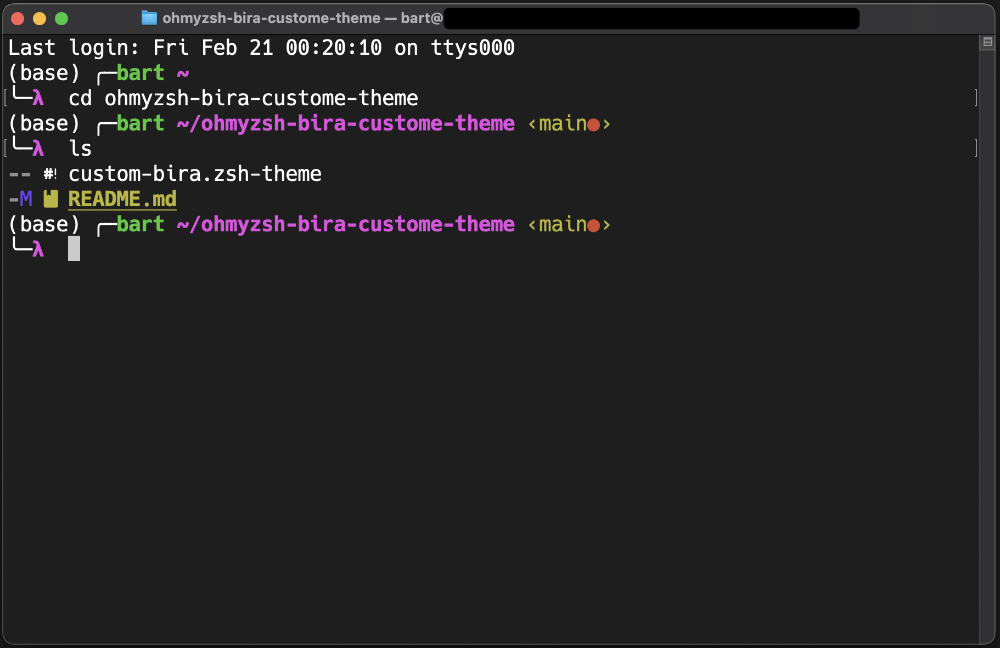

# ohmyzsh-bira-custome-theme

> If you don't have Oh My Zsh installed yet, visit https://ohmyz.sh/ to find all the information on how to install it on your computer.  

To install this customized "bira theme" copy `custom-bira.zsh-theme` file in to `~/.oh-my-zsh/themes` folder.  
Next you must edit this line in to your `~/.zshrc` file:  
`ZSH_THEME="custom-bira.zsh-theme"`  
To reload your zsh configuration run this command: `source ~/.zshrc`  
  
After completing these steps, your terminal should look like this:  
  

  
  